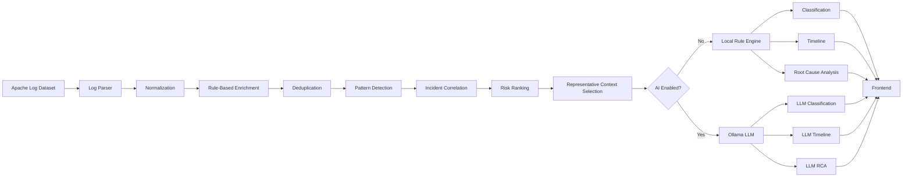
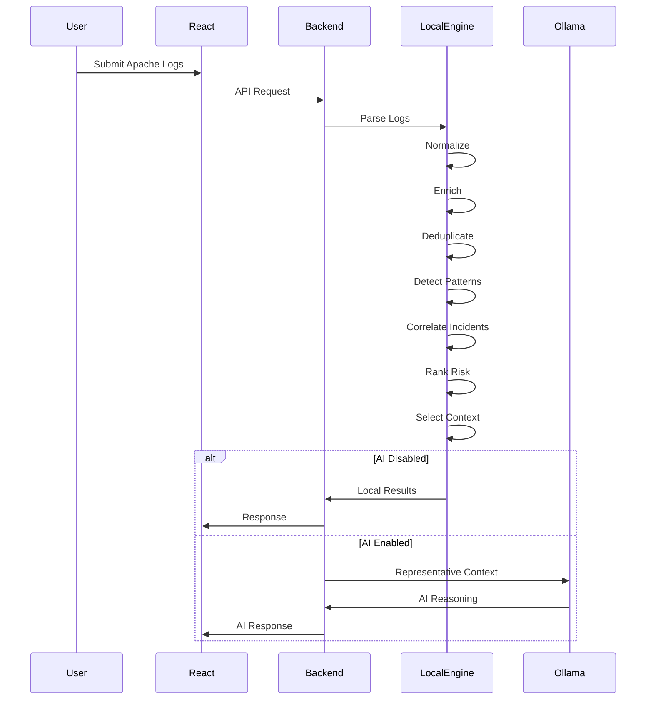
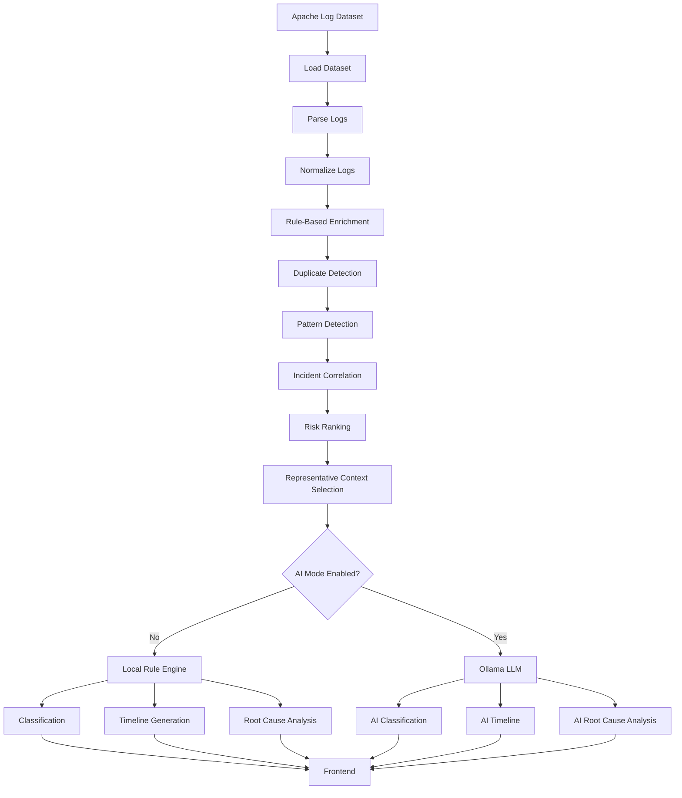
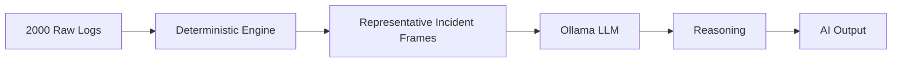

# AI Log Intelligence Engine

> A Hybrid AI-Powered Infrastructure Log Analysis Platform using Deterministic Intelligence + Large Language Models (LLMs)


---

# Overview

AI Log Intelligence Engine is a hybrid AI-powered platform that transforms raw Apache server logs into meaningful operational insights.

Instead of sending thousands of raw logs directly to a Large Language Model (LLM), the system first performs intelligent preprocessing, enrichment, deduplication, clustering, incident correlation, and context selection using a deterministic analysis engine.

Only the most representative high-risk incident contexts are forwarded to an LLM (Ollama/Llama 3.2) for semantic reasoning.

This hybrid architecture significantly reduces context size, improves response quality, minimizes hallucinations, and demonstrates an efficient AI workflow suitable for production-scale infrastructure monitoring.

---

# Key Features

## AI Log Classification

Automatically classifies Apache log entries into operational categories such as

- Worker Failure
- Worker Initialization
- Security
- Backend Communication
- Performance
- Configuration
- Startup
- Shutdown
- Warning
- Error
- Unknown

Each classification includes

- Category
- Severity
- Confidence Score
- AI Explanation
- Recommended Action

---

## Incident Timeline Generation

Automatically reconstructs infrastructure incidents by

- Detecting repeated failures
- Correlating related events
- Compressing duplicate logs
- Building chronological incident timelines

Each timeline event contains

- Timestamp
- Event Title
- Summary
- Component
- Severity
- Supporting Log References
- Analyst Notes
- Recommended Actions

---

## Root Cause Analysis (RCA)

Performs intelligent infrastructure analysis to identify

- Root Cause
- Supporting Evidence
- Confidence Score
- Impact Assessment
- Affected Components
- Recommended Remediation

---

## Hybrid AI Architecture

Supports two execution modes.

### Local Rule Engine

Fast deterministic analysis.

No LLM required.

Suitable for

- Large datasets
- Low latency
- Offline execution

---

### Ollama AI Mode

Uses

- Llama 3.2
- Local LLM
- Context-aware reasoning

Only representative incident frames are sent to the model.

This significantly reduces inference cost and context size.

---

# Architecture



---

# High-Level Workflow



---

# Why Hybrid AI?

Most LLM-based log analysis systems send the complete log dataset directly to the model.

For large infrastructure logs this becomes

- Expensive
- Slow
- Token inefficient
- Prone to hallucinations

Instead, this project follows a hybrid architecture.

The deterministic engine performs

- Parsing
- Enrichment
- Deduplication
- Pattern Detection
- Incident Correlation
- Risk Ranking
- Context Selection

Only representative incident frames are passed to the LLM.

This approach

- Reduces context size by more than 99%
- Improves response quality
- Produces deterministic preprocessing
- Keeps AI focused on reasoning rather than parsing

This design directly aligns with the assessment requirement:

> "Candidates are expected to design an efficient preprocessing and context-selection strategy before interacting with the language model."

---

# Project Workflow

The AI Log Intelligence Engine follows a hybrid processing architecture where deterministic algorithms handle log preprocessing and context reduction before optionally invoking a Large Language Model (LLM) for semantic reasoning.

The complete workflow is shown below.



---

# Local Rule Engine

The local engine performs deterministic infrastructure analysis without requiring any AI model.

This enables

- Fast execution
- Low latency
- Zero token cost
- Offline execution
- Explainable reasoning

The processing pipeline consists of:

1. Log Parsing
2. Normalization
3. Metadata Extraction
4. Rule-Based Enrichment
5. Duplicate Removal
6. Pattern Detection
7. Incident Correlation
8. Risk Ranking
9. Context Selection

The local engine can analyze the complete Apache dataset (2000+ logs) within milliseconds.

---

# AI Pipeline

Unlike traditional AI systems, the language model is **not** responsible for parsing the raw log dataset.

Instead, the LLM receives only carefully selected representative incident contexts generated by the deterministic preprocessing engine.

This significantly improves response quality while reducing computational cost.



---

# Context Selection Strategy

One of the core objectives of this project is efficient context selection before interacting with the LLM.

Instead of sending every Apache log entry to the model, the preprocessing engine performs several optimization steps.

## Step 1 — Parsing

Raw Apache log entries are parsed into structured objects.

Example

```text
Raw Log

[Sun Dec 04 06:01:30 2005] [error] mod_jk child workerEnv in error state 6
```

↓

```json
{
  "timestamp":"Sun Dec 04 06:01:30 2005",
  "level":"error",
  "component":"mod_jk",
  "message":"workerEnv in error state 6"
}
```

---

## Step 2 — Rule-Based Enrichment

Each log is enriched with deterministic metadata.

Example

```text
Category
Severity
Confidence
Tags
Recommended Action
Component
```

---

## Step 3 — Deduplication

Large log datasets usually contain hundreds of repeated events.

Example

```text
539 identical worker failure logs
```

↓

Compressed into

```text
1 representative event
Duplicate Count = 539
```

This dramatically reduces unnecessary LLM processing.

---

## Step 4 — Pattern Detection

The engine identifies recurring operational patterns.

Examples

- Worker Failure
- Security Access Control
- Worker Registration
- Backend Communication
- Configuration Issues

---

## Step 5 — Incident Correlation

Related patterns are merged into infrastructure incidents.

Instead of hundreds of independent logs, the engine produces concise incident summaries.

Example

```text
Worker Failure

Occurrences

539

First Seen

04:47:44

Last Seen

19:15:57

Confidence

97%
```

---

## Step 6 — Risk Ranking

Each detected incident receives a calculated risk score based on

- Severity
- Frequency
- Category
- Operational Impact

Only the highest-risk incidents are forwarded to the LLM.

---

## Step 7 — Representative Context Selection

Finally, the preprocessing engine selects only a handful of representative events.

Example

```
Input Dataset

2000 Logs

↓

Unique Patterns

6

↓

Correlated Incidents

5

↓

Representative Logs

5

↓

LLM
```

This preprocessing strategy reduces token usage by over 99% while preserving the most important operational information.

---

# Why Not Send Every Log to the LLM?

Sending the complete dataset directly to the language model would introduce several problems.

- Increased inference time
- Higher memory usage
- Larger prompt size
- Higher computational cost
- More hallucinations
- Repeated redundant information

Instead, deterministic preprocessing filters the dataset before semantic reasoning begins.

This allows the LLM to focus exclusively on high-value incident analysis.

---

# Local Engine vs AI Mode

| Feature | Local Engine | Ollama AI |
|----------|--------------|-----------|
| Parsing | ✅ | Uses Local Engine |
| Enrichment | ✅ | Uses Local Engine |
| Deduplication | ✅ | Uses Local Engine |
| Pattern Detection | ✅ | Uses Local Engine |
| Incident Correlation | ✅ | Uses Local Engine |
| Context Selection | ✅ | Uses Local Engine |
| Classification | Rule-Based | Semantic Reasoning |
| Timeline | Rule-Based | AI Narrative |
| Root Cause Analysis | Rule-Based | AI Reasoning |
| Latency | ~20–100 ms | Depends on model size |
| Internet Required | ❌ | ❌ (Runs locally using Ollama) |

---

# Technology Stack

## Frontend

- React.js
- Axios
- CSS

## Backend

- Node.js
- Express.js

## AI

- Ollama
- Llama 3.2

## Processing Engine

- Custom Rule-Based Classification
- Pattern Detection Engine
- Incident Correlation Engine
- Timeline Reconstruction Engine
- Root Cause Analysis Engine

## Dataset

Apache HTTP Server Log Dataset (Apache_2k.log)

---

# Project Structure

```
AI-Log-Intelligence/
│
├── backend/
│   ├── src/
│   │
│   ├── controllers/
│   │   └── ai.controller.js
│   │
│   ├── services/
│   │   ├── ai.service.js
│   │   ├── logParser.service.js
│   │   ├── classificationPipeline.service.js
│   │   ├── timelinePipeline.service.js
│   │   ├── rootCausePipeline.service.js
│   │   ├── incidentCorrelation.service.js
│   │   ├── patternDetection.service.js
│   │   ├── context.service.js
│   │   └── inputAdapter.service.js
│   │
│   ├── routes/
│   │   └── ai.routes.js
│   │
│   ├── utils/
│   │   └── response.js
│   │
│   ├── datasets/
│   │   └── Apache_2k.log
│   │
│   ├── server.js
│   └── package.json
│
├── frontend/
│   ├── src/
│   │   ├── components/
│   │   ├── services/
│   │   ├── App.jsx
│   │   └── main.jsx
│   │
│   └── package.json
│
├── README.md
├── LICENSE
└── .gitignore
```

---

# Installation

## Clone Repository

```bash
git clone https://github.com/yourusername/ai-log-intelligence.git

cd ai-log-intelligence
```

---

# Backend Setup

```bash
cd backend

npm install
```

Create a `.env` file

```env
PORT=5000

OLLAMA_URL=http://localhost:11434

OLLAMA_MODEL=llama3.2
```

Start Backend

```bash
npm run dev
```

---

# Frontend Setup

```bash
cd frontend

npm install

npm run dev
```

---

# Ollama Setup

Install Ollama

https://ollama.com

Download model

```bash
ollama pull llama3.2
```

Start Ollama

```bash
ollama serve
```

Verify

```bash
ollama list
```

Expected

```
llama3.2
```

---

# API Documentation

---

## Load Dataset

```
GET /api/ai/load-dataset
```

Response

```json
{
  "success": true,
  "data": {
    "totalLogs":2000,
    "sampleLogs":[]
  }
}
```

---

## Upload Dataset

```
POST /api/ai/upload-dataset
```

Form Data

```
file : Apache_2k.log
```

---

## Log Classification

```
POST /api/ai/log-classification
```

### Local Engine

```json
{
    "useAI": false,

    "logs":[
        "[error] mod_jk child workerEnv in error state 6"
    ]
}
```

### Ollama AI

```json
{
    "useAI": true,

    "logs":[
        "[error] mod_jk child workerEnv in error state 6"
    ]
}
```

Response

```json
{
    "category":"Worker Failure",

    "severity":"High",

    "confidence":95,

    "recommendedAction":"..."
}
```

---

## Incident Timeline

```
POST /api/ai/incident-timeline
```

### Local

```json
{
    "useAI":false
}
```

### AI

```json
{
    "useAI":true
}
```

Response

```json
{
    "incidentSummary":"...",

    "timeline":[]
}
```

---

## Root Cause Analysis

```
POST /api/ai/root-cause-analysis
```

### Local

```json
{
    "useAI":false
}
```

### AI

```json
{
    "useAI":true
}
```

Response

```json
{
    "rootCause":"...",

    "supportingEvidence":[],

    "impact":"...",

    "recommendedAction":"..."
}
```

---

# Engine Modes

The system supports two execution modes.

## 1. Local Rule Engine

```
useAI = false
```

Workflow

```
Logs

↓

Parsing

↓

Enrichment

↓

Classification

↓

Timeline

↓

Root Cause Analysis
```

Characteristics

- Fast
- Deterministic
- Explainable
- No LLM dependency
- Suitable for complete datasets

---

## 2. Ollama AI

```
useAI = true
```

Workflow

```
Logs

↓

Preprocessing

↓

Representative Context

↓

Ollama

↓

Semantic Reasoning
```

Characteristics

- Context-aware reasoning
- Human-like explanations
- AI-generated recommendations
- Uses selected incident frames
- Token efficient

---

# Assignment Mapping

| Assignment Requirement | Implementation |
|-------------------------|----------------|
| AI Log Classification | ✅ |
| Incident Timeline Generation | ✅ |
| Root Cause Analysis | ✅ |
| Local Rule Engine | ✅ |
| AI-powered Reasoning | ✅ |
| Context Selection | ✅ |
| Prompt Engineering | ✅ |
| Apache Log Processing | ✅ |
| REST APIs | ✅ |
| Hybrid AI Architecture | ✅ |
| Efficient Preprocessing | ✅ |

---

# Performance

| Operation | Local Engine | Ollama AI |
|------------|-------------|-----------|
| Classification | ~20–80 ms | 8–20 sec |
| Timeline | ~30–100 ms | 20–60 sec |
| Root Cause Analysis | ~40–120 ms | 15–30 sec |

---


# Design Decisions

## Why a Hybrid Architecture?

Instead of relying entirely on a Large Language Model (LLM), the system combines deterministic log processing with AI reasoning.

The deterministic engine is responsible for:

- Parsing raw Apache logs
- Extracting metadata
- Rule-based enrichment
- Duplicate detection
- Pattern detection
- Incident correlation
- Risk ranking
- Representative context selection

Only the most relevant incident contexts are forwarded to the LLM.

This approach provides:

- Faster processing
- Lower computational cost
- Reduced token usage
- Improved explainability
- Better scalability for large log datasets

---

# AI Prompt Engineering

The LLM is designed to act as an experienced Site Reliability Engineer (SRE) rather than a generic chatbot.

Each AI module uses carefully designed prompts to ensure:

- Strict JSON responses
- No hallucinated log entries
- Context-aware explanations
- Infrastructure-focused reasoning
- Professional remediation suggestions

Different prompts are used for:

- Log Classification
- Incident Timeline Generation
- Root Cause Analysis

---

# Context Selection Strategy

One of the key objectives of this project is minimizing unnecessary LLM interaction.

Instead of processing thousands of logs directly, the pipeline performs:

```
Raw Logs
    │
    ▼
Log Parsing
    │
    ▼
Normalization
    │
    ▼
Rule-Based Enrichment
    │
    ▼
Deduplication
    │
    ▼
Pattern Detection
    │
    ▼
Incident Correlation
    │
    ▼
Risk Ranking
    │
    ▼
Representative Context Selection
    │
    ▼
LLM
```

Only representative incidents are passed to the LLM, significantly reducing inference time and improving reasoning quality.

---

# Error Handling

The system includes graceful fallback mechanisms.

If Ollama is unavailable or returns invalid JSON:

- The Local Rule Engine continues processing.
- APIs remain functional.
- Deterministic analysis is returned to the user.

This ensures reliability even when AI services are unavailable.

---

# Scalability

The architecture is designed to scale with larger datasets.

Future enhancements may include:

- Distributed preprocessing
- Streaming log ingestion
- Incremental clustering
- Multi-threaded analysis
- Vector database integration
- Retrieval-Augmented Generation (RAG)

---

# Testing

The APIs were tested using Postman.

Test scenarios included:

- Single log classification
- Multiple log classification
- Large Apache datasets
- AI mode enabled
- Local engine mode
- Invalid requests
- Empty datasets
- Uploaded datasets

---

# Deployment

## Frontend

Recommended platforms:

- Vercel
- Netlify

## Backend

Recommended platforms:

- Render
- Railway
- Azure App Service
- AWS EC2

## AI Model

Ollama should be installed on the backend machine.

Example:

```bash
ollama serve
```

Download model:

```bash
ollama pull llama3.2
```

---

# Challenges Faced

During development several engineering challenges were addressed:

- Efficient preprocessing before LLM interaction
- Handling duplicate log entries
- Incident correlation across thousands of logs
- Designing deterministic fallback mechanisms
- Reliable JSON parsing from LLM responses
- Prompt engineering for infrastructure reasoning
- Balancing deterministic rules with AI-generated insights

---

# Future Scope

Potential enhancements include:

- Kubernetes log analysis
- Nginx log support
- Docker log parsing
- Linux system log analysis
- Windows Event Log support
- Distributed tracing integration
- Real-time streaming with Apache Kafka
- Prometheus and Grafana integration
- AI-powered anomaly detection
- Multi-agent incident investigation
- Retrieval-Augmented Generation (RAG)
- Fine-tuned infrastructure language models

---

# Repository

```
AI-Log-Intelligence
│
├── backend
│
├── frontend
│
├── README.md
│
├── LICENSE
│
├── .gitignore
│
└── .env.example
```


# Final Notes

This project demonstrates a production-inspired hybrid AI architecture for infrastructure log intelligence. Instead of treating the Large Language Model as the primary processing engine, deterministic algorithms perform parsing, enrichment, deduplication, pattern detection, incident correlation, and context selection before AI reasoning.

This design aligns with modern AI engineering practices by reducing unnecessary LLM computation while improving explainability, scalability, and operational reliability. The result is an intelligent log analysis platform capable of classifying infrastructure events, reconstructing incident timelines, and performing root cause analysis using both deterministic logic and semantic AI reasoning.

---

---

<p align="center">
<i>Built and maintained by Rishu Shukla</i>
</p>

---

---
